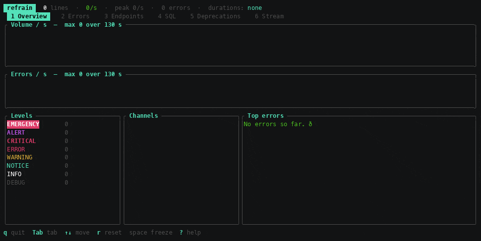

# refrain

[](https://github.com/slashfan/refrain/actions/workflows/ci.yml)

Real-time **Symfony / Monolog** log analyser for your terminal.

It follows one or more log files the way `tail -f` does, parses them on the fly
and shows a dashboard: errors grouped by type, slowest endpoints, traffic peaks.

Your logs have a refrain: the same error, the same SQL query, over and over.
That is what it looks for.



On a development machine: **≈ 1.7 million lines/s** — 237 MB analysed in
0.69 s — for a few dozen megabytes of memory. That memory is **capped by
design**: a bounded-error histogram for the quantiles, a ring buffer for the
time axis,
and a ceiling on every table (routes, error signatures, SQL shapes, open
requests). It therefore varies with what the logs contain, never with the size
of the file: 10 MB or 40 GB, it is the same order of magnitude. **Every one of
those ceilings is covered by a test**: the table stops growing without ever
stopping counting what it already knows.

That figure is meant to be replayed rather than believed:

```bash
cargo run --release --bin bench
```

```
corpus    : 1,208,100 lines, 237.6 MB — /tmp/refrain-bench-100000-g1.log
parser    :    2,545,641 lines/s   (475 ms)
+ aggregate:   1,666,726 lines/s   (725 ms)
```

The benchmark generates its corpus with `genlogs` from a fixed seed, then
measures two things: parsing one line, then parsing **and** aggregating. Reading
the file is deliberately off the clock — it is the CPU being measured, not the
disk. The headline figure is the real binary's, reading included: it beats the
single-threaded measurement because parsing runs in the reading thread while
aggregation runs in the main one.

Measured on an Apple M5 Pro, rustc 1.98.1, `release` profile. On another machine
the numbers will differ; the method will not.

The demo above is remade the same way — `./docs/demo.sh` — from a versioned
scenario. It is therefore not doomed to go stale the first time the interface
changes.

## Installing

Binaries are published with every version:
[Releases](https://github.com/slashfan/refrain/releases).

```bash
# Linux x86_64 — static (musl), no system dependency: it starts on a server with
# an ancient glibc, where a conventional binary would refuse to.
curl -sSL https://github.com/slashfan/refrain/releases/latest/download/refrain-linux-x86_64.tar.gz | tar xz
```

```bash
# macOS Apple Silicon (refrain-macos-x86_64.tar.gz for Intel Macs)
curl -sSL https://github.com/slashfan/refrain/releases/latest/download/refrain-macos-arm64.tar.gz | tar xz
```

The macOS binaries are unsigned. Fetched with `curl` they run without fuss;
downloaded from a browser, quarantine has to be lifted with
`xattr -d com.apple.quarantine refrain`.

Every release carries a `SHA256SUMS` file, checkable with `shasum -c`.

## Building it yourself

Rust 1.88 or newer.

```bash
cargo build --release
```

With no logs at hand, the `genlogs` binary makes realistic ones:

```bash
cargo run --release --bin genlogs -- --rate 300 var/log/prod.log
```

`--spread 200` dates the requests over the last two hundred seconds instead of
writing them all at this instant: enough to fill the graphs, and enough to try
`--since` out.

And in another terminal:

```bash
cargo run --release -- var/log/prod.log
```

A text summary, no dashboard, for a cron job or CI:

```bash
cargo run --release -- --summary var/log/prod.log
```

`-n` limits it to the tail of the file, without re-reading the forty gigabytes
that precede it:

```bash
cargo run --release -- --summary -n 100000 var/log/prod.log
```

## The five tabs

| Tab | What it shows |
| --- | --- |
| **Overview** | volume and errors per second (sparklines), breakdown by level and by response class, chattiest channels, top errors |
| **Errors** | errors grouped by signature, with the latest occurrence in full (exception, endpoint, JSON context) |
| **Endpoints** | requests, p50, p95, max, SQL queries per request, 5xx and error rate per route |
| **SQL** | N+1 patterns: the same SQL query repeated within a single HTTP request |
| **Stream** | the latest entries, filterable by level, by pattern and by endpoint |

### Shortcuts

| Key | Effect |
| --- | --- |
| `q` | quit |
| `Esc` | drop the current filter; otherwise quit |
| `Tab`, `←` `→`, `1`–`5` | switch tab |
| `↑` `↓`, `j` `k` | move · `PgUp` `PgDn` by 10 · `g` / `G` start / end |
| `Enter` | follow the selected endpoint (Endpoints and SQL tabs) |
| `/` | search the stream · `Enter` confirms · `Esc` clears |
| `space` | freeze or resume the stream |
| `s` | change the endpoint sort (p95 → max → requests → errors) |
| `+` / `-` | raise / lower the minimum stream level |
| `w` / `y` | export the selection: to a file / to the clipboard |
| `r` | reset the counters |
| `?` | help |

`/` searches the **message**, the **channel** and the **route** at once, ignoring
case: `doctrine` isolates the SQL queries, `app_login` everything touching that
endpoint, `Connection refused` the incident itself. The pattern stays in the tab
header while it is active, so a forgotten filter never looks like logs having
gone quiet.

### Following an endpoint

`Enter` on a row of the **Endpoints** tab — or on an N+1 pattern in the **SQL**
tab — puts that endpoint under watch: the Errors, SQL and Stream tabs then show
only what concerns it. The endpoint table itself keeps everyone, since that is
where you choose; the one being followed is marked with a `▸`, and recalled in
the top banner from any tab.

That is the usual path of a diagnosis: a p95 going wrong in Endpoints, its N+1
patterns in SQL, its errors in Errors, its raw lines in Stream — without ever
retyping a filter.

The attachment goes further than the text of the lines. A Doctrine SQL query
names no route, and neither does an uncaught exception; it is the token they
share with the `Matched route` line that ties them together, and the stream
remembers it. Following `app_orders` therefore brings up its SQL queries, which
nothing in their text tied to it. Without a correlation token, only the lines
carrying a route of their own are kept.

`Enter` again on the same endpoint releases the watch, and so does `Esc`. Esc in
fact peels the filters off one after another — the search pattern first, then
the followed endpoint — and only quits when there is nothing left to peel.

### Exporting what you found

Once you hold the error, you want to paste it into a ticket. `w` writes the
selection to a file in the current directory, `y` puts it on the clipboard:

```
refrain-error-ProductNotFound-20260909-231205.txt
refrain-endpoint-api_orders_list-20260909-231240.txt
refrain-nplus1-api_orders_list-20260909-231302.txt
```

The report stands on its own: what you were looking at, when, from which files,
then the detail. For an error that means **the whole stack trace** — the screen
shows only its first three lines — along with its JSON context. For an endpoint,
its quantiles and the N+1 patterns that most often explain its p95. From the
Overview or the Stream, where nothing is selected, it is the full summary.

`y` goes through the OSC 52 escape sequence: the **terminal** is asked to do the
copying, so the clipboard is the one on the machine you are sitting at, not the
one on the server refrain runs on. It is the only way through an `ssh`, and it
adds no dependency. Not every terminal honours it — Terminal.app ignores it,
tmux wants `set -g set-clipboard on` — hence `w`, which depends on nobody.

## Recognised formats

Detection happens **line by line**, with no option to pass:

- Symfony's line format (`LineFormatter`):
  `[2026-09-09T10:23:45.123456+02:00] request.CRITICAL: … {"exception":"…"} []`
- the JSON format (`JsonFormatter`), one object per line.

Lines starting with neither `[` nor `{` — typically a multi-line stack trace —
are attached to the previous entry instead of being counted as noise.

A log is not always valid UTF-8: a latin-1 byte from an old library, a binary
blob in an exception message, a character cut in two by a rotation. Lines are
read as bytes and converted without ever failing — a faulty byte costs only the
character it occupies, never the rest of the file.

Errors are grouped by **signature**: the exception class followed by the
normalised message (digits replaced with `#`, quoted strings with `"…"`).
"Product 42 not found" and "Product 1337 not found" therefore count as one and
the same error.

## Measuring durations

Monolog writes **no duration** by default. refrain knows two ways to get one;
the Endpoints tab always shows which is in use.

### 1. A duration field in the context (recommended)

The most reliable. A subscriber on `kernel.terminate` is enough:

```php
// src/EventSubscriber/RequestDurationSubscriber.php
namespace App\EventSubscriber;

use Psr\Log\LoggerInterface;
use Symfony\Component\EventDispatcher\EventSubscriberInterface;
use Symfony\Component\HttpKernel\Event\RequestEvent;
use Symfony\Component\HttpKernel\Event\TerminateEvent;
use Symfony\Component\HttpKernel\KernelEvents;

final class RequestDurationSubscriber implements EventSubscriberInterface
{
    private float $start = 0.0;

    public function __construct(private readonly LoggerInterface $logger) {}

    public static function getSubscribedEvents(): array
    {
        return [
            KernelEvents::REQUEST => ['onRequest', 4096],
            KernelEvents::TERMINATE => 'onTerminate',
        ];
    }

    public function onRequest(RequestEvent $event): void
    {
        if ($event->isMainRequest()) {
            $this->start = microtime(true);
        }
    }

    public function onTerminate(TerminateEvent $event): void
    {
        $this->logger->info('Request finished', [
            'route' => $event->getRequest()->attributes->get('_route'),
            'method' => $event->getRequest()->getMethod(),
            'status' => $event->getResponse()->getStatusCode(),
            'duration_ms' => round((microtime(true) - $this->start) * 1000, 1),
        ]);
    }
}
```

refrain finds the usual keys on its own: `duration_ms`, `duration`, `elapsed_ms`,
`elapsed`, `response_time`, `execution_time`, `exec_time`, `runtime`,
`request_time`. For a key of your own: `--duration-key total_time`.

The unit is inferred from the suffix (`_ms`, `_s`, `_us`), then from magnitude —
a float below 30 is read as seconds, because that is what `microtime()` gives.
When in doubt: `--duration-unit ms`.

### 2. By correlating a token (without touching your code)

If every line carries a request identifier, refrain measures the gap between the
first and the last line of one request. Monolog's `UidProcessor` is enough to
switch it on:

```yaml
# config/services.yaml
services:
    Monolog\Processor\UidProcessor:
        tags: [monolog.processor]
```

Keys recognised out of the box: `token`, `uid`, `request_id`, `x-request-id`,
`trace_id`. Otherwise: `--correlate-key my_key`.

> **Worth knowing.** This method measures from the first to the last *log line*,
> not from the start to the end of the *request*: since nothing is logged after
> the last line, it **underestimates** the real duration. The ranking of
> endpoints stays right, the absolute values should be read as a floor. For
> exact figures, go through method 1.

With neither of the two, the Endpoints tab remains usable: requests are counted
thanks to the `Matched route` line of the `request` channel, and the error rate
per endpoint stays exact.

## Rotated logs

As soon as you go back to yesterday — the very case of a post-mortem — the file
is called `prod.log.1.gz`. refrain reads those as they are, decompressed on the
fly, with no temporary file:

```bash
refrain --summary var/log/prod.log.2.gz var/log/prod.log.1.gz var/log/prod.log
```

Detection is done on **the header, not the extension**: a gzipped `.log` is
recognised, a `.gz` that is not one is read as plain text. Multi-member archives
— what a `cat a.gz b.gz` produces — are read to the end.

A compressed file is closed by nature: there is nothing to follow, and no
rotation to watch for. It is read in full and then the source ends, while the
others keep being followed. `-n` is still honoured: full decompression is
unavoidable, but only the last N lines are kept, and memory stays bounded.

## Bounding the analysis in time

In a post-mortem the question is never "the last hundred thousand lines", it is
"since 2:30pm". `--since` and `--until` bound what gets **counted**:

```bash
refrain --summary --since 15m                  var/log/prod.log
refrain --summary --since 14:30 --until 15:00  var/log/prod.log
refrain --json    --since 2026-09-09T14:30:00  var/log/prod.log
```

Both accept a duration counted back from start-up (`30s`, `15m`, `2h`, `3d`) or
a date: `2026-09-09T14:30:00+02:00` with its offset, `2026-09-09 14:30` or
`2026-09-09` without — the machine's is then used — and `14:30` for today, which
is what you type in the middle of an incident.

A line outside the window weighs **nowhere**: not in the totals, not on the time
axis, not in the quantiles. Otherwise `--since 15m` would return a p95 computed
over the whole day. It is not counted as "skipped" either — `skipped` is there to
spot a format problem, not a filter doing its job. Reports say how many lines
were dropped, which keeps you from mistaking too narrow a window for an
application at rest:

```
0 entries analysed (0 skipped), 0 errors
window   : 23,116 lines dropped outside the bounds
```

`--since` implies reading the file from the start — following from the end would
show nothing until a new line arrives. On a forty-gigabyte `prod.log`, `-n`
remains the cost guard: `--since 15m -n 100000` re-reads only the tail of the
file, then keeps only the requested quarter of an hour.

## Responses, not log levels

`ERROR` and above is a **logging** decision, not the fate of a request. An
exception caught and logged at `info` still returned a 500; a hundred 404s on
`/favicon.ico` are not an outage. So when the application logs a status —
the `kernel.terminate` subscriber above already does — refrain counts responses
by class:

```
status   : 2xx 4,102 · 4xx 91 · 5xx 58 — 1.36 % 5xx
```

The **Endpoints** tab gains a `5xx` column beside `Err.`, Overview a
2xx/3xx/4xx/5xx block, and the JSON a `status` object plus `status_4xx` /
`status_5xx` per endpoint. The threshold follows:

```bash
refrain --summary --fail-if '5xx-rate>1%' --fail-if '5xx-rate:api_orders_list>0.5%' var/log/prod.log
```

Recognised keys: `status`, `status_code`, `http_status`, `response_code` — as a
number or as a string. A value outside 100–599 is some other field of the same
name, and is ignored.

The denominator is the number of lines **carrying a status**, not the number of
requests: that is the population the information exists for. With no status ever
read, the block does not appear, and the threshold stays silent rather than
reporting a reassuring zero.

## Failing a job on a threshold

A report from cron or CI is worthless if you have to read it to learn that
things are going badly. `--fail-if` returns **3** as soon as a threshold is
crossed:

```bash
refrain --summary \
  --fail-if 'error-rate>2%' \
  --fail-if 'p95>1s' \
  --fail-if 'p95:api_orders_list>800ms' \
  var/log/prod.log
```

```
refrain: threshold crossed — error-rate = 8.60 % > 2.00 %
refrain: threshold crossed — p95 (api_orders_list) = 3.35 s > 1.00 s
```

Crossed thresholds go to standard error, one per line: the report itself stays
usable through a pipe.

The grammar is deliberately narrow — `metric comparator value`:

| | |
| --- | --- |
| **Metrics** | `error-rate`, `request-error-rate`, `5xx-rate`, `errors`, `entries`, `p50`, `p95`, `p99`, `max` |
| **Comparators** | `>`, `>=`, `<`, `<=` |
| **Units** | `%` for a rate, `ms` or `s` for a duration; with no unit, a duration is in milliseconds and a rate is a fraction (`0.02` = `2%`) |

### Which error rate

`error-rate` is the share of **lines** that are errors. It therefore depends on
what you hand refrain to read — and this page tells you to hand it more: add
`doctrine.log` so N+1 patterns can be detected, and dozens of DEBUG lines per
HTTP request join the denominator. On the same 400 requests:

```
error-rate         = 0.56 %      ← a 2% threshold stays silent
request-error-rate = 6.75 %      ← same errors, divided by requests
```

`request-error-rate` divides those same errors by HTTP requests instead — the
definition the `Err.` column already uses — so it does not move when a file is
added. That is the one to hold on to in CI; `error-rate` answers a different
question, "how noisy is this log", and remains what it always was.

Both count error **lines**: a request that logs three errors weighs three. And
when no request was seen at all — no `Matched route`, no duration field —
`request-error-rate` stays silent rather than reporting a reassuring zero.

`5xx-rate` takes an endpoint like a quantile does — `5xx-rate:api_orders_list`
— since it is counted per route. With no endpoint it is global, like the other
two rates.

A quantile with no endpoint applies to **the worst of them all**: "no route may
go over one second at p95" is what you mean in CI, and the message names the
culprit. `p95:api_orders_list` targets one precise route; if it does not appear
in the logs, the threshold stays silent rather than inventing a zero that would
make it look respected.

A malformed threshold is refused **at start-up**, not after reading forty
gigabytes — and with exit code 2, which sets it apart from a threshold genuinely
crossed. `--fail-if` only makes sense on a report that ends: it is refused with
`--every`, and in the dashboard.

## JSON output (monitoring)

`--json` replaces the dashboard with a JSON object, to plug refrain into a
metrics pipeline.

A one-shot reading, typically from cron or CI:

```bash
refrain --json var/log/prod.log > /var/lib/metrics/refrain.json
```

A continuous stream, one object per line (NDJSON), never re-reading the file
from the start:

```bash
refrain --json --every 30 var/log/prod.log
```

The `totals` and `levels` counters are **cumulative** since start-up, the way a
Prometheus counter is: it is up to the collector to take the differences from
one reading to the next. `throughput` additionally provides sliding-window
rates, usable without keeping any state.

`--top N` limits the `errors` and `endpoints` lists — 25 by default, `0` for all
of them.

Exit codes tell the causes apart, so a job knows what it is dealing with:

| Code | Cause |
| --- | --- |
| **0** | all is well |
| **1** | a source could not be read |
| **2** | the command line is at fault |
| **3** | a `--fail-if` threshold was crossed |

The **1** keeps a cron job from letting a zeroed snapshot pass for "all is
well". And if a source is missing, it takes precedence over the thresholds:
incomplete figures let you assert nothing.

A consumer that goes away is none of those: `| head -1`, a collector that
restarts. refrain stops writing, says nothing, and exits **0** — the logs were
read, there is simply nobody left to tell.

<details>
<summary>Shape of a snapshot</summary>

```json
{
  "generated_at": "2026-09-09T00:52:11.482913+02:00",
  "window": { "first_seen": "…", "last_seen": "…", "span_seconds": 12.418 },
  "totals": {
    "entries": 4600, "skipped": 0, "errors": 58, "error_rate": 0.0126,
    "requests": 400, "request_error_rate": 0.145, "out_of_window": 0
  },
  "levels": { "debug": 2826, "info": 1600, "warning": 46, "critical": 58, "…": 0 },
  "status": {
    "responses": 4263, "1xx": 0, "2xx": 4102, "3xx": 12, "4xx": 91, "5xx": 58,
    "rate_5xx": 0.0136
  },
  "throughput": {
    "peak_per_second": 907,
    "peak_at": "2026-09-09T00:52:05+02:00",
    "last_5s_per_second": 517.0,
    "last_60s_per_second": 76.7
  },
  "duration_source": { "kind": "field", "key": "duration_ms" },
  "open_requests": 12,
  "capped": [],
  "sql": { "shapes": 6, "nplus1_threshold": 10 },
  "channels": [{ "channel": "doctrine", "count": 2026, "errors": 0 }],
  "errors": [
    {
      "signature": "ConnectionLost: Uncaught PHP Exception …",
      "count": 13,
      "level": "critical",
      "channel": "request",
      "exception": "Doctrine\\DBAL\\Exception\\ConnectionLost",
      "endpoint": "app_login",
      "first_seen": "…",
      "last_seen": "…",
      "message": "Uncaught PHP Exception …"
    }
  ],
  "endpoints": [
    {
      "endpoint": "api_orders_list",
      "requests": 117,
      "errors": 10,
      "error_rate": 0.0855,
      "responses": 117,
      "status_4xx": 0,
      "status_5xx": 10,
      "timed": 117,
      "p50_ms": 881.8,
      "p95_ms": 2908.7,
      "p99_ms": 3728.9,
      "max_ms": 11800.8,
      "avg_ms": 1291.88,
      "queries_avg": 29.1,
      "queries_max": 57
    }
  ],
  "nplus1": [
    {
      "endpoint": "api_orders_list",
      "sql": "SELECT t0.id, t0.email FROM customer t0 WHERE t0.id = ?",
      "requests_affected": 14,
      "max_per_request": 57,
      "avg_per_request": 30.7,
      "last_seen": "…"
    }
  ]
}
```

`duration_source.kind` is `field`, `correlation` or `none`: the collector then
knows whether the latencies are exact or merely a floor (see above).

`status.rate_5xx` is `null` when no status was read at all — the same rule as
`request_error_rate`.

`capped` lists the tables that have stopped taking new keys — `routes`,
`errors`, `channels`, `sql shapes`, `n+1 patterns`, `open requests`. Empty
means everything below is complete; a name in it means that list is a subset,
and the counters above it are still exact.

`request_error_rate` is `null` when no HTTP request was seen: nothing to divide
by, and a zero would read as good news (see above).

`peak_per_second` is the busiest second of **everything read**, not of some
recent window: on a file covering a whole day, the peak of that day. The
sliding rates next to it — `last_5s_per_second`, `last_60s_per_second` — are
the ones that describe the present. In the dashboard, `r` resets the peak along
with the rest of the counters.

</details>

## Detecting N+1 queries

An N+1 is the same SQL query run dozens of times within a single HTTP request —
the loop that reloads a related entity on every iteration. The Symfony profiler
shows it in development; in production, nobody sees it go by.

refrain leans on a convenient fact: **Doctrine logs prepared statements**, with
the parameters kept apart in `params`. Two executions of the same N+1 therefore
produce *exactly* the same string — no SQL normalisation to write, equality is
enough.

Two things are needed on the Symfony side:

**1. That Doctrine logs.** Queries land on the `doctrine` channel at `DEBUG`
level, with a `context.sql` field. In production that level is often filtered
out — and that is precisely where N+1s hide. A dedicated handler is enough to
make them visible without drowning `prod.log`:

```yaml
# config/packages/monolog.yaml
monolog:
    handlers:
        doctrine:
            type: stream
            path: '%kernel.logs_dir%/doctrine.log'
            level: debug
            channels: [doctrine]
```

Then hand both files to refrain, which merges them:

```bash
refrain var/log/prod.log var/log/doctrine.log
```

**2. A correlation token**, to know which lines belong to the same HTTP request
— the `UidProcessor` from the previous section.

The threshold is set with `--nplus1 N`: an SQL query repeated at least N times
within one HTTP request is reported. 10 by default, `0` disables it.

The **Endpoints** tab gains an `SQL/req` column along the way, the average number
of queries per HTTP request. It is often the first culprit behind a p95 going
wrong:

```
Endpoint            Requests  SQL/req  p50      p95      max      5xx  Err.
api_orders_list     73        29.1     912 ms   3.35 s   4.49 s   7    9.6%
app_search          95        2.0      230 ms   900 ms   1.08 s   0    5.3%
```

## Options

```
refrain [OPTIONS] <FILE>...

  <FILE>...                 files to follow; ".gz" read as is, "-" reads
                            standard input
  -a, --from-start          read from the start rather than from the end
  -n, --lines <N>           re-read the last N lines on start-up
  -l, --min-level <LEVEL>   initial stream level [default: debug]
      --since <WHEN>        only count from there on (15m, 14:30, a date)
      --until <WHEN>        only count up to there
      --summary             no dashboard: read to the end, then summarise
      --json                JSON output instead of the dashboard
      --every <SEC>         with --json: one NDJSON snapshot every SEC seconds
      --fail-if <THRESHOLD> fail (code 3) if the threshold is crossed; repeatable
      --top <N>             errors and endpoints detailed in JSON [25; 0 = all]
      --nplus1 <N>          N+1 detection threshold [10; 0 disables]
      --duration-key <KEY>  key carrying the duration
      --duration-unit <U>   auto | ms | s | us [default: auto]
      --correlate-key <KEY> key identifying one request
      --no-correlate        disable correlation
      --correlate-timeout <SEC>  idle time before a request is closed [5]
      --tick-ms <MS>        refresh period [250]
      --scrollback <N>      entries kept in the stream [2000]
```

Several files at once, each on its own thread:

```bash
refrain var/log/prod.log var/log/worker.log
```

From a remote machine, without installing anything there:

```bash
ssh prod 'tail -f /srv/app/var/log/prod.log' | refrain -
```

## How the code is laid out

| File | Role |
| --- | --- |
| [`src/lib.rs`](src/lib.rs) | the library: everything but the wiring |
| [`src/main.rs`](src/main.rs) | main loop, thread wiring |
| [`src/cli.rs`](src/cli.rs) | command-line options (clap) |
| [`src/event.rs`](src/event.rs) | single event channel, keyboard and clock threads |
| [`src/tail.rs`](src/tail.rs) | following files: rotation, truncation, partial line, gzip |
| [`src/parser.rs`](src/parser.rs) | one raw line → `LogEntry` |
| [`src/stats.rs`](src/stats.rs) | aggregation: time axis, quantiles, correlation |
| [`src/app.rs`](src/app.rs) | application state and reaction to keys |
| [`src/ui.rs`](src/ui.rs) | ratatui rendering |
| [`src/threshold.rs`](src/threshold.rs) | `--fail-if` thresholds: grammar and verdict |
| [`src/export.rs`](src/export.rs) | exporting the selection: report, file, OSC 52 |
| [`src/bin/genlogs.rs`](src/bin/genlogs.rs) | fake Symfony log generator |
| [`src/bin/bench.rs`](src/bin/bench.rs) | throughput benchmark |

The overall shape:

```
   tail thread(s) ──┐
   keyboard thread ─┼──► mpsc channel ──► main loop ──► ratatui
   clock thread ────┘                    (app: decides)  (ui: draws)
```

A single thread touches the state: no locks, all concurrency goes through the
channel. Reading and parsing run alongside rendering.

```bash
cargo test      # 81 tests
cargo clippy --all-targets
cargo run --release --bin bench -- --min 100000   # the CI guard
```

70 unit tests cover the parser, file following (rotation, truncation, partial
line, gzipped log including multi-member archives, invalid UTF-8 byte), the
aggregation — including every memory ceiling and the synchronisation between
several files read in parallel — N+1 detection, and rendering, that one through
ratatui's test backend, including on a tiny terminal, while a search is being
typed and while an endpoint is followed — and the export, down to the base64
encoding of the OSC 52 sequence. The parser is further exercised on seventeen
thousand twisted lines — every possible truncation, then fixed-seed mutations —
which it must survive without panicking. Eleven end-to-end tests
([`tests/cli.rs`](tests/cli.rs)) run the real binaries and plug them into each
other: generation, analysis, piping through standard input, that same pipe
closed from the other end, reading the last lines, time window and thresholds
over files with known values, reading a log compressed by the system's `gzip`,
spreading generated logs, JSON validity and exit codes.

Every change goes through a pull request with green CI: the procedure is in
[CONTRIBUTING.md](CONTRIBUTING.md).

CI replays all of it on **Linux and macOS** on every pull request, and
additionally checks formatting, clippy without a warning, that the release
binary starts, and that throughput has not collapsed.

### Publishing a version

The version in `Cargo.toml` commands: raising it in a pull request is enough,
merging publishes. The workflow lays the tag itself, builds the three targets
with the `dist` profile (stripped, LTO), and publishes the release with its
archives and their checksums.

No tag to push by hand, hence no possible drift between what the binary
announces and what is published. A merge that does not touch the version builds
nothing; a version that would go back below the latest release fails the pull
request's CI; and `cargo build --locked` refuses a `Cargo.lock` left behind. See
[CONTRIBUTING.md](CONTRIBUTING.md).

## Known limits

- **Unix only**, and that is a choice: rotation detection relies on the inode.
  On Windows you work in WSL anyway — so on Linux, where everything works.
- A compressed file is not followed: it is read once, in full. That is what it
  is — a closed log.
- Quantiles come from a histogram, not from a sorted sample: they cover
  **everything read** — or everything since `r` in the dashboard — and are exact
  to **±1.6 %**. Each octave is cut into 32 slices, so that bound holds at 1 ms
  as at 10 s; 672 counters per endpoint cover 0.06 ms to 131 s in 2.6 KB.
  `max` is not an estimate: it is tracked exactly.
- Beyond 4096 distinct routes or error signatures, new keys are no longer
  recorded (counters already known keep going). Same principle for N+1 patterns
  (1024) and retained SQL query shapes (2048). An error whose signature no longer
  fits is still counted in the total: refrain stops detailing, never counting.
  And it says so: `capped: routes` in the banner, a `capped` line in the summary,
  a `capped` list in the JSON. A table that has stopped detailing makes its own
  listing partial, and a route missing from it would otherwise read as a route
  with no traffic.
- SQL queries are identified by a 64-bit fingerprint rather than by their text,
  so as not to duplicate it in every open request. A collision remains
  theoretically possible, but negligible at this scale.
- A line dated in the future is brought back to the current time for the time
  axis, so that a skewed clock does not empty the graphs.
- Two runs over the same files produce the same report, down to the order of
  the rows: ties are broken by name, never left to the hash table.

## Licence

[MIT](LICENSE) — © 2026 Nicolas Cabot.

The copyright notice travels with the published binaries: every release archive
contains the `LICENSE` file, as the licence requires.
